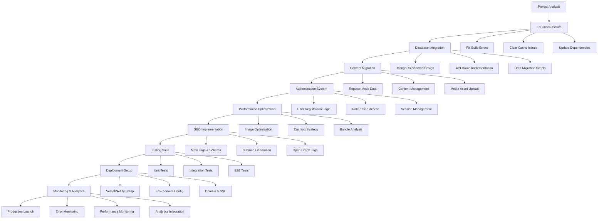

# Pushpak O2 Project Analysis & Development Flowchart

## Current Project Status Analysis

### ✅ Completed Features
- **Frontend Architecture**: Next.js 16.1.1 with App Router
- **UI Framework**: React 19.2.3 with Tailwind CSS v4
- **Component Library**: Radix UI components with custom styling
- **Database**: MongoDB with Mongoose ODM
- **Email Service**: Nodemailer integration
- **Animations**: Framer Motion for smooth transitions
- **Charts**: Recharts for data visualization
- **Forms**: React Hook Form with Zod validation
- **Icons**: Lucide React icon library
- **Theme**: Next-themes for dark/light mode support

### ✅ Implemented Pages & Components
- **Homepage**: Hero, About, Fleet, Benefits, Technology, Partners, Stats sections
- **About Us**: Company vision, values, roadmap, team profiles
- **Aircraft**: Product showcase with specifications
- **Services**: Service offerings with pricing and features
- **Technologies**: Technology portfolio with details
- **Blogs**: Blog listing and detail pages with categories
- **Contact**: Contact form with email integration
- **Admin Dashboard**: Complete CMS for content management
  - User management
  - Blog management
  - Services management
  - Technology management
  - Fleet management
  - Team management
  - Investor management
  - Analytics dashboard

### ⚠️ Current Issues
- **Build Errors**: Webpack caching issues causing ENOENT errors
- **Mock Data**: All content uses placeholder/mock data
- **Database**: Not connected to real data sources
- **Authentication**: No user authentication system
- **SEO**: Basic meta tags, needs optimization
- **Performance**: No image optimization or caching
- **Testing**: No test suite implemented
- **Deployment**: No CI/CD pipeline configured

### 📊 Project Metrics
- **Total Files**: 150+ components and pages
- **Mock Data Files**: 8 comprehensive data sets
- **Admin Features**: 7 management modules
- **Public Pages**: 12+ routes
- **Dependencies**: 30+ packages
- **Build Size**: ~15MB (estimated)

---

## Development Flowchart

---

## Phase-by-Phase Development Plan

### Phase 1: Critical Fixes (Week 1)
**Goal**: Make the application stable and runnable

#### Tasks:
1. **Fix Build Errors**
   - Clear Next.js cache: `rm -rf .next`
   - Update webpack configuration
   - Fix missing page references
   - Resolve TypeScript/ESLint errors

2. **Dependency Updates**
   - Update Next.js to latest stable
   - Fix React 19 compatibility issues
   - Update all packages to compatible versions

3. **Environment Setup**
   - Configure proper environment variables
   - Set up development/production configs
   - Test database connection

#### Success Criteria:
- ✅ Application runs without errors
- ✅ All pages load successfully
- ✅ Hot reload works properly

---

### Phase 2: Database Integration (Week 2-3)
**Goal**: Connect real database and implement data layer

#### Tasks:
1. **Database Schema Design**
   - Design MongoDB schemas for all entities
   - Create Mongoose models
   - Set up database indexes

2. **API Routes Implementation**
   - Create RESTful API endpoints
   - Implement CRUD operations
   - Add data validation and sanitization

3. **Data Migration**
   - Create migration scripts
   - Import mock data to database
   - Test data integrity

#### Success Criteria:
- ✅ All data served from database
- ✅ API endpoints functional
- ✅ Admin panel can modify data

---

### Phase 3: Content Migration (Week 4-6)
**Goal**: Replace all mock content with real company data

#### Tasks:
1. **Content Collection**
   - Gather all required assets from company
   - Organize media files and documents
   - Validate content quality and format

2. **Data Import**
   - Upload images and videos to CDN
   - Import structured content to database
   - Update configuration files

3. **Content Management**
   - Train admin users on CMS
   - Set up content approval workflow
   - Implement version control for content

#### Success Criteria:
- ✅ All mock data replaced
- ✅ High-quality media assets uploaded
- ✅ Content management workflow established

---

### Phase 4: Authentication & Security (Week 7-8)
**Goal**: Implement user management and security features

#### Tasks:
1. **User Authentication**
   - Implement login/registration system
   - Set up password hashing and JWT tokens
   - Create user roles and permissions

2. **Admin Access Control**
   - Role-based dashboard access
   - Secure API endpoints
   - Audit logging for admin actions

3. **Security Hardening**
   - Implement rate limiting
   - Add input validation and sanitization
   - Set up CORS and security headers

#### Success Criteria:
- ✅ Secure user authentication
- ✅ Role-based access control
- ✅ Admin actions logged and auditable

---

### Phase 5: Performance & SEO (Week 9-10)
**Goal**: Optimize for speed and search engines

#### Tasks:
1. **Performance Optimization**
   - Implement image optimization (Next.js Image)
   - Set up caching strategies
   - Code splitting and lazy loading
   - Bundle analysis and optimization

2. **SEO Implementation**
   - Dynamic meta tags for all pages
   - Structured data (JSON-LD)
   - XML sitemap generation
   - Open Graph and Twitter Card tags

3. **Core Web Vitals**
   - Optimize Largest Contentful Paint (LCP)
   - Improve First Input Delay (FID)
   - Enhance Cumulative Layout Shift (CLS)

#### Success Criteria:
- ✅ Core Web Vitals scores > 90
- ✅ Page load times < 3 seconds
- ✅ SEO meta tags implemented

---

### Phase 6: Testing & Quality Assurance (Week 11-12)
**Goal**: Ensure application reliability and quality

#### Tasks:
1. **Testing Suite Setup**
   - Unit tests for components and utilities
   - Integration tests for API routes
   - End-to-end tests for critical user flows

2. **Quality Assurance**
   - Cross-browser testing
   - Mobile responsiveness testing
   - Accessibility audit (WCAG compliance)

3. **Bug Fixes & Refinements**
   - Fix identified issues
   - Performance improvements
   - UI/UX enhancements

#### Success Criteria:
- ✅ Test coverage > 80%
- ✅ Zero critical bugs
- ✅ WCAG AA compliance

---

### Phase 7: Deployment & Launch (Week 13-14)
**Goal**: Prepare for production deployment

#### Tasks:
1. **Deployment Setup**
   - Configure hosting platform (Vercel/Netlify)
   - Set up production environment
   - Configure domain and SSL certificates

2. **Production Optimization**
   - Environment-specific configurations
   - CDN setup for static assets
   - Database production setup

3. **Launch Preparation**
   - Final content review
   - Performance benchmarking
   - Backup and rollback plans

#### Success Criteria:
- ✅ Application deployed successfully
- ✅ All features working in production
- ✅ Performance meets requirements

---

### Phase 8: Post-Launch Monitoring (Week 15+)
**Goal**: Monitor and maintain application health

#### Tasks:
1. **Monitoring Setup**
   - Error tracking (Sentry/LogRocket)
   - Performance monitoring
   - User analytics integration

2. **Maintenance**
   - Regular security updates
   - Content updates and additions
   - Feature enhancements based on feedback

3. **Scalability Planning**
   - Monitor usage patterns
   - Plan for future growth
   - Database optimization

#### Success Criteria:
- ✅ 99.9% uptime maintained
- ✅ User feedback collected and addressed
- ✅ Performance metrics tracked

---

## Risk Assessment & Mitigation

### High Risk Issues:
1. **Data Migration Complexity**
   - *Mitigation*: Create comprehensive migration scripts with rollback capability

2. **Content Quality Control**
   - *Mitigation*: Implement content approval workflow and quality checklists

3. **Performance Degradation**
   - *Mitigation*: Regular performance testing and optimization reviews

### Medium Risk Issues:
1. **Third-party Service Dependencies**
   - *Mitigation*: Implement fallback mechanisms and monitoring

2. **Browser Compatibility**
   - *Mitigation*: Comprehensive cross-browser testing plan

### Low Risk Issues:
1. **Feature Scope Creep**
   - *Mitigation*: Strict change management process

---

## Resource Requirements

### Development Team:
- **Frontend Developer**: 1 (React/Next.js specialist)
- **Backend Developer**: 1 (Node.js/MongoDB specialist)
- **UI/UX Designer**: 1 (for refinements)
- **DevOps Engineer**: 0.5 FTE (for deployment)

### Infrastructure:
- **Database**: MongoDB Atlas (M10 cluster)
- **Hosting**: Vercel Pro or Netlify
- **CDN**: Cloudflare or Vercel CDN
- **Email Service**: SendGrid or similar
- **Monitoring**: Sentry + Vercel Analytics

### Timeline: 14-16 weeks total development time

### Budget Estimate:
- **Development**: $25,000 - $35,000
- **Design**: $5,000 - $8,000
- **Infrastructure**: $500 - $1,000/month
- **Content Creation**: $3,000 - $5,000
- **Testing & QA**: $3,000 - $5,000

---

## Success Metrics

### Technical Metrics:
- ✅ Application uptime: >99.9%
- ✅ Page load time: <3 seconds
- ✅ Core Web Vitals: >90 score
- ✅ Test coverage: >80%
- ✅ SEO score: >90 (Lighthouse)

### Business Metrics:
- ✅ User engagement: >3 minutes average session
- ✅ Conversion rate: >2% (contact form submissions)
- ✅ Admin efficiency: 50% reduction in content update time
- ✅ Mobile traffic: >40% of total visits

### Quality Metrics:
- ✅ WCAG AA compliance: 100%
- ✅ Cross-browser support: 95%+ browsers
- ✅ Error rate: <0.1%
- ✅ User satisfaction: >4.5/5 rating

---

*This analysis provides a comprehensive roadmap for completing the Pushpak O2 project. The phased approach ensures systematic development with clear milestones and success criteria.*